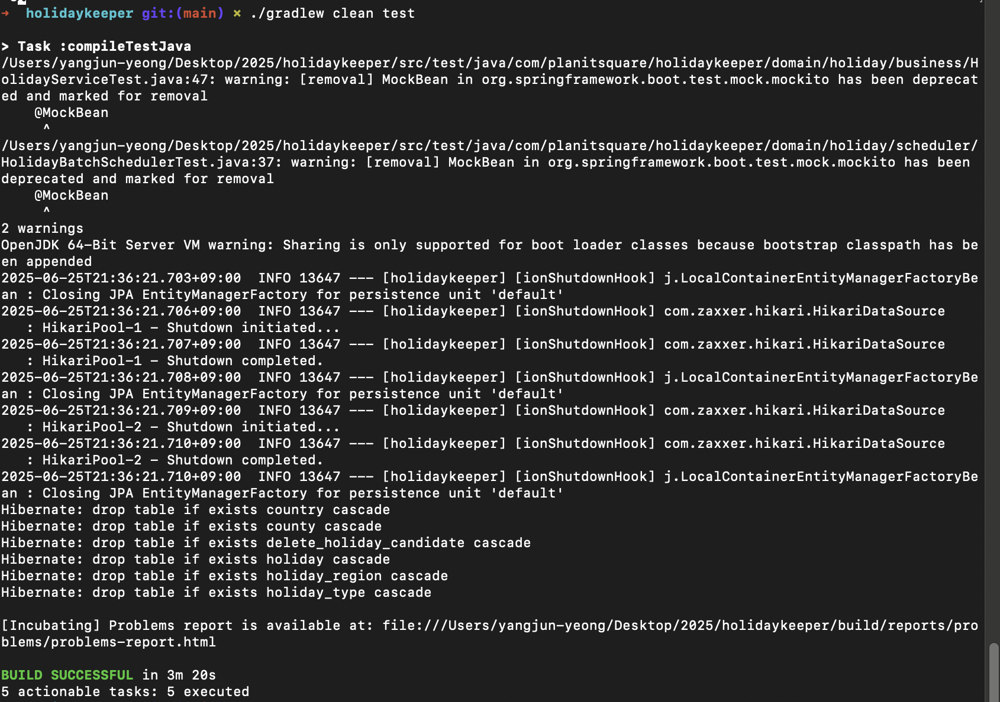

# HolidayKeeper

공휴일/국가 데이터 관리 및 외부 API(Nager) 연동, Swagger(OpenAPI) 문서화가 적용된 Spring Boot 프로젝트입니다.

---

## 1. 빌드 & 실행 방법

```bash
# 1. 의존성 설치 및 빌드
./gradlew clean build

# 2. 애플리케이션 실행
./gradlew bootRun

# 3. (테스트 실행)
./gradlew clean test
```

---

## 2. REST API 명세 요약 (Swagger 기반)

### [국가 목록 조회]

- **GET** `/v1/country`
- **응답 예시**
  ```json
  [
    {
      "id": 1,
      "code": "KR",
      "name": "대한민국"
    },
    {
      "id": 2,
      "code": "US",
      "name": "미국"
    }
  ]
  ```

### [공휴일 검색]

- **GET** `/v1/holiday?country=KR&fromYear=2024&toYear=2024&global=true&type=PUBLIC`
- **파라미터**:
  - `country` (국가코드, 예: KR)
  - `fromYear` (검색 시작 연도, 1900~2100)
  - `toYear` (검색 종료 연도, 1900~2100)
  - `global` (전역 공휴일 여부, true/false)
  - `type` (공휴일 타입: PUBLIC, BANK, SCHOOL, AUTHORITIES, OPTIONAL, OBSERVANCE)
- **응답 예시**
  ```json
  {
    "content": [
      {
        "countryCode": "KR",
        "name": "신정",
        "localName": "New Year's Day",
        "date": "2024-01-01",
        "fixed": true,
        "global": true,
        "launchYear": 1949,
        "types": ["PUBLIC"],
        "regionCodes": ["11", "26"]
      }
    ],
    "totalElements": 1,
    "totalPages": 1
  }
  ```

### [공휴일 upsert]

- **POST** `/v1/holiday`
- **RequestBody 예시**
  ```json
  {
    "year": 2024,
    "countryCode": "KR"
  }
  ```
- **응답**: `"Upsert 완료"`

### [공휴일 상태 DELETE로 변경]

- **PATCH** `/v1/holiday/delete`
- **RequestBody 예시**
  ```json
  {
    "year": 2024,
    "countryCode": "KR"
  }
  ```
- **응답**: `"N건 상태값 DELETE로 변경 완료"`
---

## 3. Swagger UI 및 OpenAPI 문서

- **Swagger UI 접속:**
  [http://localhost:8080/swagger-ui.html](http://localhost:8080/swagger-ui.html)
- **OpenAPI JSON:**
  [http://localhost:8080/v1/api-docs](http://localhost:8080/v3/api-docs)
- 각 API의 파라미터/응답/에러/예시/제약조건이 매우 상세하게 문서화되어 있습니다.

---

## 4. 테스트 성공 스크린샷

---

